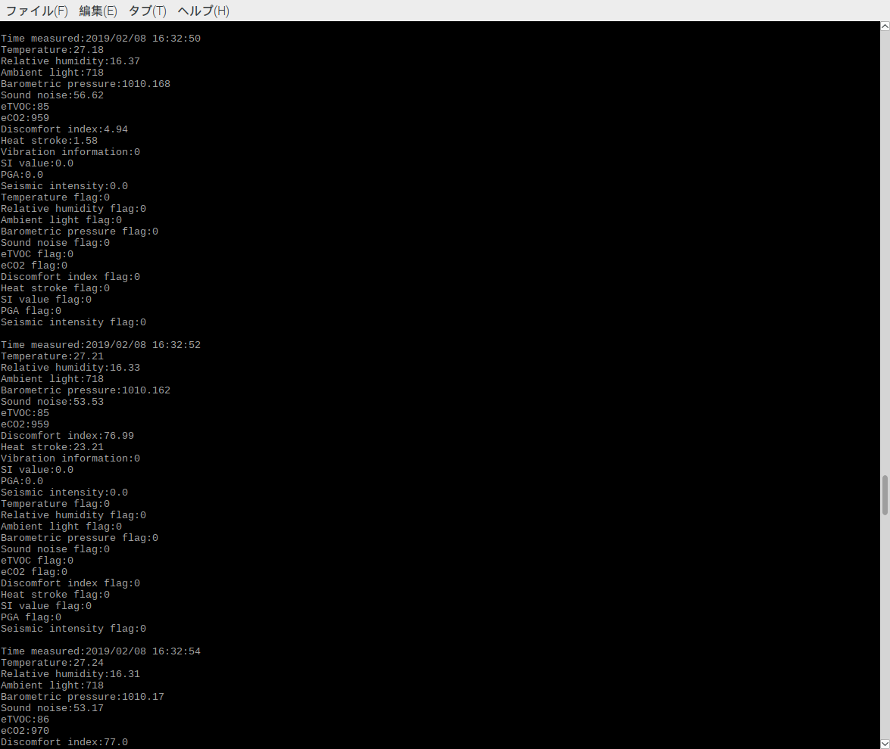

# 2jciebu-usb-raspberrypi
It is a sample program for evaluating Omron's sensor 2JCIE-BU with Raspberry Pi 3 Model B.  

2JCIE-BU is a multifunction sensor module that can be used for sensing various environmental information.  
Various sensors such as temperature, humidity, light, barometric pressure, noise, 3 axis acceleration, etc. are equipped.  
Earthquakes can be judged based on highly accurate vibration acceleration.  
We utilize a volatile organic compound (VOC GAS) sensor to realize continuous monitoring of indoor air quality.  
USB and Bluetooth® are provided as interfaces.  


## language
- [English](./README.md)
- [Japanase](./README_ja.md)

## Description
- sample_2jciebu.py  
It is a sample program that can acquire sensing data with the USB serial interface and check it on the console.  
The LED lights up while data is being acquired.

***DEMO:***  
When you run sample_2jciebu.py, you can see the sensing data on console.  



## Installation
1. It is necessary to install dependency software beforehand.  
    [Dependencies](#link)
2. Open Terminal and execute the following command.    
    ```
    $ mkdir omron_sensor
    $ cd omron_sensor
    $ git clone https://github.com/omron-devhub/2jciebu-usb-raspberrypi.git
    ```

## Usage
Procedure to operate the sample program.
- sample_2jciebu.py  
Open Terminal and execute the following command.  
    ```
    $ sudo modprobe ftdi_sio
    $ sudo chmod 777 /sys/bus/usb-serial/drivers/ftdi_sio/new_id
    $ sudo echo 0590 00d4 > /sys/bus/usb-serial/drivers/ftdi_sio/new_id
    $ sudo python3 sample_2jciebu.py
    ```
    To stop, press Ctrl + C.

## Dependencies
2jciebu-usb-raspberrypi requires the following dependencies:
- [Python3](https://www.python.org/)
- [pyserial](https://pythonhosted.org/pyserial/pyserial.html#installation)

## Contributors
Thank you to all our [contributors](https://github.com/omron-devhub/2jciebu-usb-raspberrypi/graphs/contributors) !

## Licence
Copyright (c) OMRON Corporation. All rights reserved.

Licensed under the MIT License.
